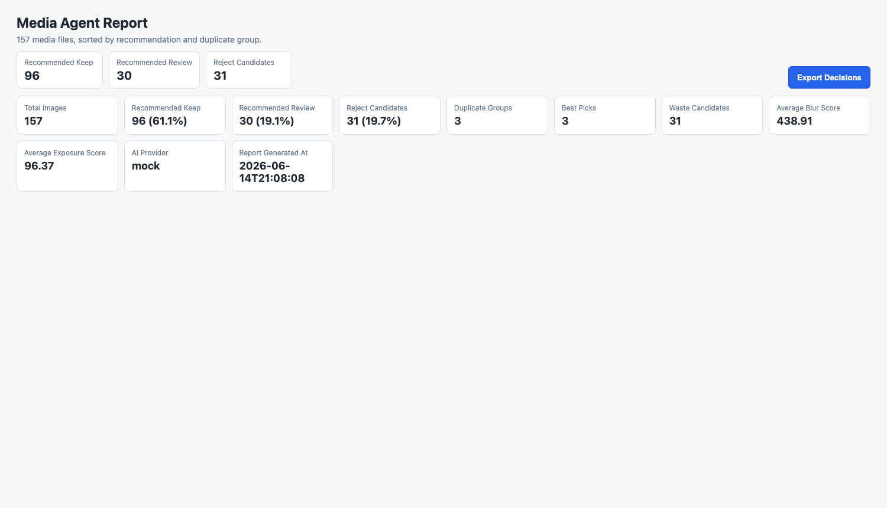
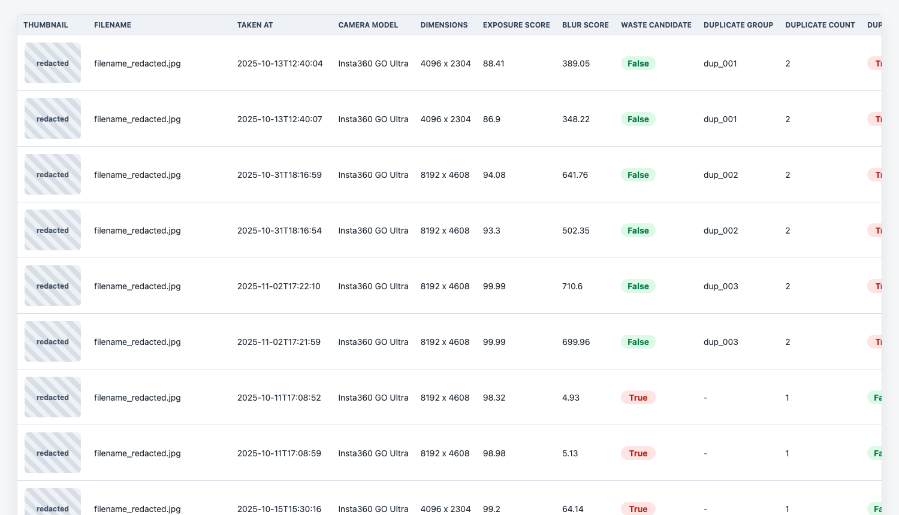

# Media Agent

AI-assisted visual asset management for photographers and content creators.

[](https://github.com/HouJue919/media-agent/actions/workflows/test.yml)

Current release: v0.1.0 Portfolio Release

Media Agent is a local-first Python project for reviewing, organizing, and documenting large photo libraries. It scans a folder of image files, extracts metadata and EXIF data, evaluates basic visual quality, detects duplicate or similar photos, recommends the best image in each duplicate group, and generates both CSV and interactive HTML reports.

The project is designed as a practical media workflow tool and as a portfolio-ready software project. It focuses on clear data structures, reproducible outputs, safe file handling, and a modular architecture that can later support real AI vision models and video processing.

This repository includes a reproducible synthetic demo dataset and automated GitHub Actions CI, so the project can be tested without private media files.

## Project Overview

Modern photo libraries often contain hundreds or thousands of images from cameras, phones, drones, and action cameras. Many files are blurry, underexposed, overexposed, duplicated, or only useful as archive material. Media Agent provides a structured first pass over that media:

- Scan a photo folder and build a searchable media index.
- Extract camera and image metadata.
- Generate thumbnails for fast visual review.
- Score exposure and sharpness using traditional computer vision.
- Detect duplicate or visually similar images with perceptual hashing.
- Recommend keep, review, or reject candidates.
- Let the user make final decisions in an HTML report.
- Safely organize selected files without deleting originals.

The current version is **v2.2**.

## Screenshots

The screenshots below were generated from a full 157-photo test run. Personal thumbnails and file names are redacted before being committed to the repository.





## Project Architecture


## Portfolio Highlights

- **Computer vision:** Uses OpenCV-based heuristics for blur and exposure analysis.
- **Perceptual hashing:** Detects duplicate and similar images with pHash Hamming distance.
- **EXIF metadata processing:** Extracts camera, lens, exposure, focal length, ISO, and capture-time metadata.
- **Recommendation logic:** Combines quality scores, duplicate grouping, and image resolution to recommend keep, review, or reject candidates.
- **Human-in-the-loop review:** Keeps final user decisions in the browser and exports them as `decisions.csv`.
- **Safe file organization:** Copies or moves reviewed files into decision folders without providing a destructive delete workflow.
- **Bilingual report support:** Generates English and Chinese HTML reports from the same processing pipeline.

## Engineering Quality

- Automated pytest test suite
- GitHub Actions CI
- Reproducible demo dataset
- Safe file organization
- No private media required for testing

## Supported Media

Current photo formats:

- `.jpg`
- `.jpeg`
- `.png`
- `.heic`
- `.arw`

Notes:

- HEIC support depends on `pillow-heif`.
- ARW files are scanned and EXIF extraction is attempted. If local RAW decoding is unavailable, quality analysis may be skipped for that file without stopping the full export.
- A `video` module is reserved for future video support, including frame extraction with `ffmpeg`.

## Features

### Photo Scanning

- Recursive or non-recursive folder scanning.
- Structured records for every supported media file.
- CSV output with stable columns for downstream analysis.

### Metadata and EXIF Extraction

Media Agent extracts:

- File name
- File path
- File size
- Created time
- Modified time
- Image width and height
- Camera model
- Lens model
- Focal length
- Aperture
- Shutter speed
- ISO
- Capture time

### Quality Analysis

The first version intentionally uses traditional computer vision instead of external AI APIs.

Computed fields include:

- `exposure_score`
- `overexposed_ratio`
- `underexposed_ratio`
- `blur_score`
- `is_blurry`
- `waste_candidate`
- `quality_error`

### Thumbnail Generation

- Generates thumbnails into a `thumbnails/` folder.
- Adds `thumbnail_path` to the CSV.
- Displays thumbnails directly in the HTML report.

### Duplicate and Similar Photo Detection

- Uses perceptual hashing with the `imagehash` library.
- Stores `phash` for each image.
- Treats images as similar when pHash Hamming distance is `<= 6`.
- Groups similar images with `duplicate_group_id`.
- Adds duplicate-related fields:
  - `duplicate_group_id`
  - `duplicate_count`
  - `is_duplicate_candidate`

### Best Pick Recommendation

For each duplicate group, Media Agent ranks photos and recommends a single best pick.

The ranking considers:

- Higher `blur_score`
- Higher `exposure_score`
- `waste_candidate=False`
- Higher image resolution

Generated fields:

- `group_best_pick`
- `group_rank`
- `keep_recommendation`
- `recommendation_reason`

Only one photo in each duplicate group can be marked as `group_best_pick=True`.

### Recommendation Reasons

Every photo receives a short explanation, such as:

- `sharp image, good exposure`
- `blurry image`
- `overexposed`
- `underexposed`
- `duplicate but best in group`
- `duplicate and not best pick`
- `low quality candidate`
- `slightly blurry, review needed`

This makes the report easier to audit and helps avoid treating the tool as a black box.

### Interactive HTML Report

Media Agent generates a static HTML report in either English or Chinese.

The report includes:

- Thumbnail
- File name
- Capture time
- Camera model
- Dimensions
- Exposure score
- Blur score
- Waste candidate flag
- Duplicate group information
- Best-pick ranking
- System recommendation
- Recommendation reason
- Mock AI tagging fields
- Manual decision controls

The report supports three manual decisions:

- `keep`
- `review`
- `reject`

Manual choices are stored in browser `localStorage`. The page can export a `decisions.csv` file containing:

- `file_path`
- `keep_recommendation`
- `user_decision`

### Dashboard Summary

Starting in v2.2, the top of the HTML report includes a project dashboard:

- Total image count
- Keep, review, and reject-candidate counts
- Keep, review, and reject-candidate percentages
- Duplicate group count
- Best-pick count
- Waste-candidate count
- Average blur score
- Average exposure score
- AI provider
- Report generation time

### Mock AI Tagging Architecture

Media Agent v2.0 introduced AI tagging fields without calling any external API.

The current AI tagging system is a local mock implementation. It uses simple keyword rules from file names, file paths, existing metadata, and recommendation fields.

Generated fields:

- `ai_description`
- `ai_tags`
- `scene_type`
- `subject_type`
- `suggested_use`
- `ai_confidence`
- `ai_provider`

The mock provider is useful for validating the data model, CSV export, HTML report layout, multilingual labels, and command-line interface before connecting a real vision model.

Important:

- No OpenAI API is used.
- No network connection is required.
- AI tagging is disabled by default.
- The only supported provider in v2.0-v2.2 is `mock`.

### Safe File Organization

After exporting `decisions.csv` from the report, Media Agent can organize files into decision-based folders.

It creates:

- `selected_keep/`
- `selected_review/`
- `selected_reject/`

Safety principles:

- Default mode is `copy`.
- `move` is available but must be explicitly selected.
- There is no delete function.
- File name collisions are handled automatically.
- Every action is written to `organize_log.csv`.

## Tech Stack

- **Python 3** - command-line application and processing pipeline
- **Pillow** - image loading and dimension extraction
- **pillow-heif** - HEIC support on supported systems
- **OpenCV** - blur and exposure analysis
- **NumPy** - numeric image processing
- **exifread** - EXIF metadata extraction
- **imagehash** - perceptual hash generation
- **CSV** - portable structured output
- **Static HTML, CSS, and JavaScript** - interactive reports without a backend server
- **Browser localStorage** - local manual decision persistence

## Project Structure

```text
.
+-- main.py
+-- requirements.txt
+-- README.md
+-- LICENSE
+-- demo_media
+-- scripts
|   +-- generate_demo_media.py
+-- tests
+-- media_agent
    +-- __init__.py
    +-- scanner.py
    +-- metadata.py
    +-- quality.py
    +-- thumbnail.py
    +-- similarity.py
    +-- best_pick.py
    +-- report.py
    +-- export.py
    +-- organize.py
    +-- ai_tagging
    |   +-- __init__.py
    |   +-- tagger.py
    +-- video
        +-- __init__.py
```

## Version Progress

### v1.0 - Photo Indexing Foundation

- Scanned image folders.
- Supported JPG, JPEG, PNG, HEIC, and ARW.
- Extracted file information, image dimensions, and EXIF metadata.
- Added basic exposure and blur analysis.
- Exported `media_index.csv`.
- Established a modular project structure.

### v1.1 - Thumbnails and HTML Report

- Generated thumbnails for each image.
- Added `thumbnail_path` to the CSV.
- Generated a static `report.html`.
- Displayed thumbnail, file information, camera metadata, and quality scores.
- Sorted likely waste candidates toward the top of the report.

### v1.2 - Duplicate and Similar Photo Detection

- Added `similarity.py`.
- Computed perceptual hashes with `imagehash`.
- Grouped similar photos using pHash Hamming distance `<= 6`.
- Added duplicate fields to CSV and HTML.
- Updated sorting to prioritize waste and duplicate candidates.

### v1.3 - Best Pick in Duplicate Groups

- Added `best_pick.py`.
- Ranked photos inside duplicate groups.
- Recommended one best photo per duplicate group.
- Added:
  - `group_best_pick`
  - `group_rank`
  - `keep_recommendation`
- Sorted the report around keep, review, and reject-candidate recommendations.

### v1.4 - Human-in-the-Loop Review

- Added keep, review, and reject controls to the HTML report.
- Stored user decisions in browser `localStorage`.
- Added a decision export button.
- Exported `decisions.csv`.
- Kept the workflow non-destructive.

### v1.5 - Safe File Organization

- Added `organize.py`.
- Read `decisions.csv`.
- Organized files into selected keep, review, and reject folders.
- Defaulted to copy mode.
- Added optional move mode.
- Prevented overwriting duplicate file names.
- Generated `organize_log.csv`.

### v2.0 - Mock AI Tagging Architecture

- Added `media_agent/ai_tagging/tagger.py`.
- Added local mock AI tagging fields.
- Added `--enable-ai-tags`.
- Added `--ai-provider mock`.
- Kept AI tagging disabled by default.
- Avoided external APIs, network calls, and model dependencies.

### v2.1 - Recommendation Reasons and Improved Review Logic

- Added `recommendation_reason`.
- Improved keep, review, and reject-candidate logic.
- Made middle-quality and uncertain photos fall into `review`.
- Added clearer reasons for blur, exposure, duplicate, and quality decisions.

### v2.2 - Report Dashboard

- Added a summary dashboard to the HTML report.
- Included counts, percentages, duplicate statistics, best-pick count, waste count, average scores, AI provider, and report generation time.
- Kept bilingual English and Chinese report support.

## Installation

Clone the repository, enter the project directory, create a virtual environment, and install dependencies:

```bash
git clone https://github.com/HouJue919/media-agent.git
cd media-agent
python3 -m venv .venv
source .venv/bin/activate
pip install -r requirements.txt
```

Replace the repository URL and directory name if you are using a fork.

## Demo Quick Start

Media Agent includes a generated public demo dataset. The demo images are synthetic assets created with Python and Pillow, not private photos.

```bash
python scripts/generate_demo_media.py
python main.py demo_media --language en --report demo_report.html --enable-ai-tags --ai-provider mock
```

This creates a local `demo_report.html`, `media_index.csv`, and `thumbnails/`. These generated outputs are ignored by Git.

## Usage

### Basic Scan

```bash
python main.py /path/to/photos
```

This creates:

- `media_index.csv`
- `report.html`
- `thumbnails/`

### Generate a Chinese Report

```bash
python main.py /path/to/photos --language zh --report report_zh.html
```

### Generate an English Report

```bash
python main.py /path/to/photos --language en --report report_en.html
```

### Enable Mock AI Tags

Chinese report:

```bash
python main.py /path/to/photos --language zh --report report_zh.html --enable-ai-tags --ai-provider mock
```

English report:

```bash
python main.py /path/to/photos --language en --report report_en.html --enable-ai-tags --ai-provider mock
```

Without `--enable-ai-tags`, the AI columns remain in the CSV and HTML report but their values are empty.

### Custom CSV Output

```bash
python main.py /path/to/photos --output /path/to/media_index.csv
```

### Custom HTML Report Output

```bash
python main.py /path/to/photos --report /path/to/report.html
```

### Custom Thumbnail Directory

```bash
python main.py /path/to/photos --thumbnail-dir /path/to/thumbnails
```

### Disable Recursive Scanning

```bash
python main.py /path/to/photos --no-recursive
```

### Organize Files from Manual Decisions

After exporting `decisions.csv` from the HTML report:

```bash
python main.py --decisions decisions.csv
```

By default, this copies files into:

```text
organized_media/
+-- selected_keep/
+-- selected_review/
+-- selected_reject/
+-- organize_log.csv
```

Use a custom output folder:

```bash
python main.py --decisions decisions.csv --organize-output /path/to/organized_media
```

Use copy mode explicitly:

```bash
python main.py --decisions decisions.csv --mode copy
```

Use move mode explicitly:

```bash
python main.py --decisions decisions.csv --mode move
```

There is intentionally no delete mode.

## Testing

Install dependencies and run the test suite:

```bash
pip install -r requirements.txt
pip install pytest
pytest
```

The tests cover scanner extension handling, perceptual-hash duplicate grouping, best-pick ranking, and safe organization behavior.

## Main Output Files

### `media_index.csv`

The main structured index of scanned media. It includes file metadata, EXIF fields, thumbnail paths, quality scores, duplicate information, best-pick recommendations, recommendation reasons, and AI tagging fields.

### `report.html`, `report_zh.html`, or `report_en.html`

A static interactive report for reviewing photos visually. It includes sorting, thumbnails, dashboard metrics, system recommendations, manual decision buttons, and decision export.

### `decisions.csv`

Exported from the HTML report after manual review. It stores final user decisions and can be used by the organization workflow.

### `organized_media/`

The default output directory for safely copied or moved files based on manual decisions.

## Design Principles

- **Local-first:** Core workflows run locally and do not require a server.
- **Non-destructive:** The project does not delete original files.
- **Human-in-the-loop:** Automated recommendations are treated as a first pass, not a final authority.
- **Modular:** Scanning, metadata, quality analysis, duplicate detection, best-pick logic, reporting, AI tagging, and organization are separate modules.
- **Extensible:** The mock AI tagging layer is designed so real vision providers can be added later.
- **Portfolio-ready:** The project demonstrates data processing, computer vision heuristics, CLI design, static report generation, and safe file automation.

## Current Limitations

- Mock AI tagging does not inspect real image content. It uses keyword rules and existing metadata.
- Quality scoring is heuristic and may need tuning for different camera types.
- RAW file decoding depends on the local environment.
- Duplicate detection uses perceptual hashing and may not catch all near-duplicates.
- The HTML report is static and stores manual choices in browser-local storage.

## Future Roadmap

Planned directions include:

- Real AI vision providers:
  - OpenAI Vision
  - local CLIP
  - YOLO
  - BLIP
- Video support:
  - `ffmpeg` frame extraction
  - video thumbnails
  - scene-level tagging
  - video quality signals
- Configurable thresholds for blur, exposure, duplicate distance, and review logic.
- Search and filter controls inside the HTML report.
- Project profiles for different workflows, such as travel, documentary, social media, or archive cleanup.
- SQLite or lightweight database indexing for larger media collections.
- Better RAW support and camera-specific metadata handling.
- Packaging as a simple desktop application for non-technical users.
- Automated tests for scanning, sorting, duplicate grouping, report generation, and organization.

## Example Workflow

```bash
# 1. Scan a photo folder and generate an English report with mock AI fields.
python main.py /path/to/photos --language en --report report_en.html --enable-ai-tags --ai-provider mock

# 2. Open the report in a browser and make manual keep/review/reject decisions.

# 3. Export decisions.csv from the report.

# 4. Safely copy selected files into organized folders.
python main.py --decisions decisions.csv --organize-output organized_media --mode copy
```

## Status

Media Agent is currently a working local prototype at **v2.2**. It is ready for small to medium photo review workflows and is structured for future AI and video expansion.

## License

This project is licensed under the MIT License.
